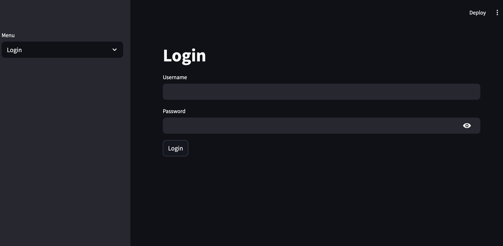
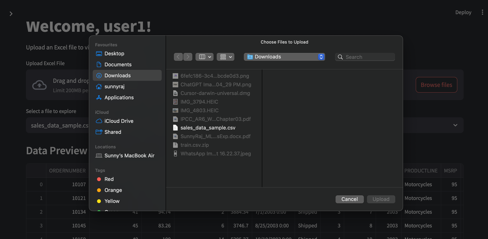
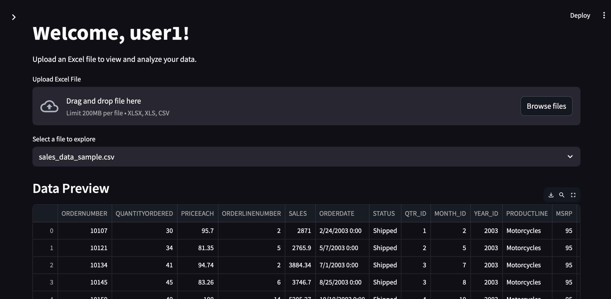

# 📊 Dashlytic: Personalized Data Dashboard with Secure Authentication

Dashlytic is a robust, user-centric data dashboard built with Streamlit. It offers secure authentication, personalized user experiences, and dynamic data visualizations.

---

## 🚀 Feature Roadmap

### ✅ Authentication System


* User registration and login via Streamlit forms.
* Secure password storage using bcrypt.
* Session management with `st.session_state`.

### ✅ Conditional Page Access

* Restricted access to dashboard pages for authenticated users only.
* Redirection of unauthenticated users to the login page.

### ✅ Configurable Data Sources


* Support for Excel/CSV files using pandas.
* Database integration via SQLAlchemy.
* User interface for selecting data sources and uploading credentials.

### ✅ User-Specific Dashboards


* Loading of user-specific configurations or datasets post-login.
* Mapping of users to their respective dashboards or datasets using a JSON file or database table.

### ✅ Export as csv

* After applying filters also user can export the data into excel.

---

## 🧠 Tech Stack

* Python 3.10+
* Streamlit
* pandas and SQLAlchemy for data ingestion
* bcrypt for password hashing
* SQLite or PostgreSQL for database management
* (Optional) Auth0 for production-ready authentication

---

## 📈 Dashboard Capabilities

* Interactive visualizations using Plotly, Altair, or Matplotlib.
* Dynamic filtering options with Streamlit widgets (`st.selectbox`, `st.slider`, etc.).
* Data export functionality for downloading filtered datasets.

---

## 🔧 Setup Instructions

1. **Clone the Repository**:

   ```bash
   git clone https://github.com/sunnyraj94/dashlytic.git
   cd dashlytic
   ```


2. **Create a Virtual Environment**:

   ```bash
   python -m venv venv
   source venv/bin/activate  # On Windows: venv\Scripts\activate
   ```


3. **Install Dependencies**:

   ```bash
   pip install -r requirements.txt
   ```


4. **Run the Application**:

   ```bash
   streamlit run app.py
   ```


---

## 📂 Project Structure

```plaintext
dashlytic/
├── app.py
├── backend/
│   ├── auth/
│   │   ├── login.py
│   │   └── signup.py
│   └── utils/
│       ├── hashing.py
│       └── session_manager.py
├── config/
│   └── user_db.json
├── data/
│   └── sample_data.xlsx
├── pages/
│   ├── dashboard.py
│   └── settings.py
├── requirements.txt
└── README.md
```


---

## 📌 Notes

* Ensure that the `user_db.json` file is securely stored and not exposed publicly.
* Regularly update dependencies to patch security vulnerabilities.
* Consider integrating Auth0 for enhanced security in production environments.

---

## 📝 To-Do

* 🚀 **Custom Graph Suggestions**: Enable users to select multiple columns and receive suggested graph types based on data characteristics.

* 🚀 **Export Visualizations**: Provide functionality to save generated graphs as image files (e.g., PNG, JPEG) for reporting purposes.

* 🚀 **Configurable Logging**: Implement logging mechanisms that can be directed to either a local file system or a database, based on configuration settings.

* 🚀 **Database-Backed Authentication**: Transition user login management from JSON files to a relational database system, configurable via the application's settings.

* 🚀 **User Interface Enhancements**: Refine the UI for improved usability, including responsive design, intuitive navigation, and aesthetic improvements.

* 🚀 **Real-Time Data Updates**: Incorporate real-time data streaming capabilities to reflect live data changes within the dashboard.

* 🚀 **Data Summarization Feature**: Add a feature that summarizes selected columns, providing statistics like mean, median, mode, and standard deviation.

* 🚀 **Caching Mechanisms**: Implement caching strategies to optimize performance, reducing load times for frequently accessed data and computations.

---

## 📞 Contact

For questions or support, please contact 
*  @ [EMAIL](mailto:mail.sunnyraj94@gmail.com).
*  @ [Linkedin](https://www.linkedin.com/in/sunny-raj-74631416b/).


---